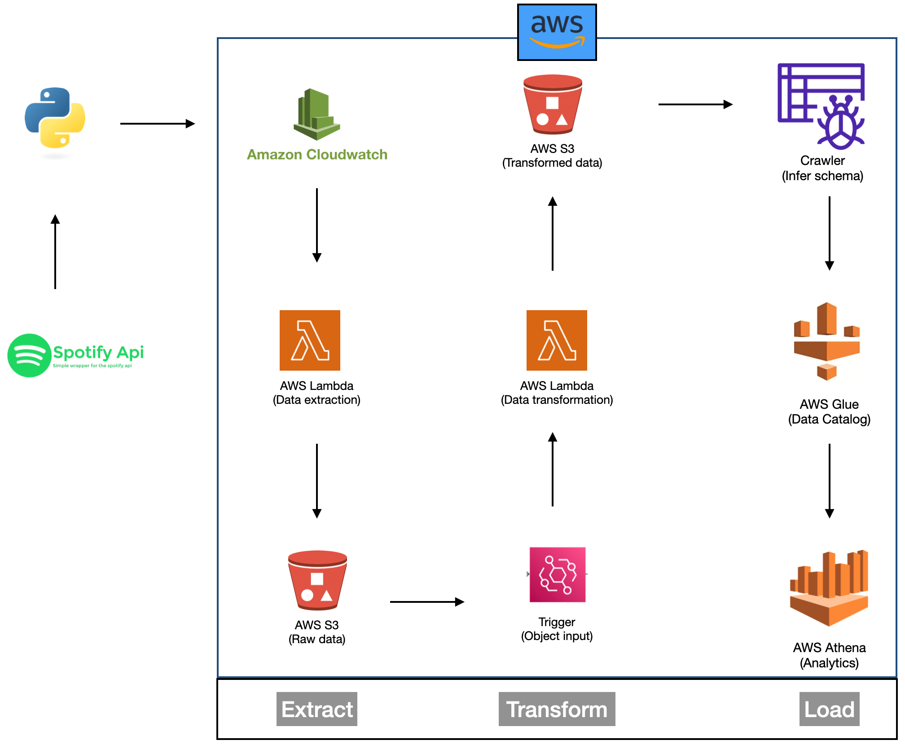

# Spotify ETL Project on AWS

## Overview

This project is an end-to-end ETL (Extract, Transform, Load) pipeline designed to automate the extraction of data from a Spotify playlist and process it using various AWS services. The goal is to showcase proficiency in data engineering and AWS, with a focus on data extraction, transformation, and automated processing.

## Project Architecture

## Project Setup

1. **Spotify Playlist and API:**
    - Created a Spotify API account.
    - Located the target Spotify playlist at [Spotify Playlist Link](https://open.spotify.com/playlist/37i9dQZEVXbNG2KDcFcKOF).

2. **Amazon S3 Bucket:**
    - Set up an Amazon S3 bucket named "spotify-etl-project-arun."

3. **Folder Structure:**
    - Within the S3 bucket, established a structured folder hierarchy:
        - `raw_data/`
            - `processed/`
            - `to_processed/`
        - `transformed_data/`
            - `album_data/`
            - `artist_data/`
            - `songs_data/`

## Key Components

### Data Extraction (AWS Lambda - `spotify_api_data_extract`)

- Created an AWS Lambda function named `spotify_api_data_extract`.
- This function extracts data from the Spotify playlist and saves it in the `raw_data/to_processed/` folder within the S3 bucket.
- The extraction process is performed using the Spotify API.

### Data Transformation and Loading (AWS Lambda - `spotify_transformation_load_function`)

- Developed an AWS Lambda function named `spotify_transformation_load_function`.
- This function handles the transformation and loading of data into distinct folders:
    - `album_data/`
    - `artist_data/`
    - `songs_data/`
- The data transformation involves:
    - Parsing the raw JSON data.
    - Creating separate functions for albums, artists, and songs.
    - Using these functions to transform the data and convert it into dataframes.
    - Applying data cleaning operations such as dropping duplicates and converting data types (e.g., datetime).
    - Saving the transformed data as CSV files in their respective folders.
    
### Automation and Data Update

- To ensure data is kept up-to-date, an automated process is implemented:
    - New data is fetched from the Spotify playlist whenever the playlist is updated.
    - Transformed data is saved in the `raw_data/processed/` folder.
    - The raw data in `raw_data/to_processed/` is deleted, ensuring an updated dataset is always available.

## Project Results

- Insights and observations obtained from the data, such as statistics, patterns, or visualizations will be written once the project is complete.

## Challenges Faced

- While working on this Spotify ETL project, I encountered several challenges that required creative problem-solving and learning. Some of the main challenges included:

    - **Spotify API Integration:** Integrating the Spotify API to access and retrieve data from the playlist was a learning curve. It required understanding authentication mechanisms and handling rate limits.

    - **Data Transformation:** Transforming the raw data into structured formats involved complex data manipulation. This included dealing with nested JSON structures and converting them into usable data frames.

    - **Automating ETL Process:** Designing an automated ETL process that continuously updates the data from Spotify to S3 and triggers transformations posed a unique challenge. Ensuring that the process is both efficient and reliable was a significant task.

    - **Data Cleaning:** Managing and cleaning the data to remove duplicates, handle missing values, and ensure data consistency required careful attention.

    - **Error Handling:** Building robust error handling mechanisms to gracefully manage failures and ensure the pipeline runs smoothly was a critical aspect of the project.

    Overcoming these challenges not only improved my technical skills but also enhanced my problem-solving abilities. It's essential to acknowledge that facing and conquering these hurdles was an integral part of the learning process.

## Future Improvements

- Our Spotify ETL project is continually evolving, and we have exciting plans to enhance its capabilities. Here are some areas we're focusing on for future improvements:

    - **Real-time Data Updates:** We aim to implement real-time data extraction to ensure our dataset is always up-to-date, syncing with changes in the Spotify playlist as they occur.

    - **Efficient Parallel Processing:** We're working on enabling parallel processing to efficiently handle larger datasets, improving our project's scalability.

    - **Data Quality Assurance:** To maintain data integrity, we're planning to implement data quality checks and monitoring to swiftly identify and address any issues.

    - **Streaming Analytics:** Exploring streaming data platforms will provide us with real-time insights and opportunities for immediate actions.

    - **Advanced Analytics:** Expanding our project's capabilities to include features like recommendation engines and sentiment analysis will offer richer data insights.

    - **User-Friendly Dashboard:** We're considering the development of an intuitive dashboard for data visualization, making our project more user-friendly.

    - **Community Collaboration:** We welcome and encourage contributions from the community to foster collaborative improvements and new ideas.

    - **Cost Optimization:** Continuously managing AWS service costs to ensure efficient resource allocation is a priority.

    - **Documentation and Tutorials:** We're committed to providing comprehensive project documentation and tutorials, making it easier for users and contributors to understand and engage with our project.
  
    These future improvements reflect our dedication to keeping our project current, efficient, and community-focused. Stay tuned for exciting updates!

## Portfolio Presentation

- [Link to your portfolio presentation or document] (will write later)

## Demo

- [Link to a video demonstration of your project]

## GitHub Repository

- [[Link to your GitHub repository where the project code is available](https://github.com/arunsinp/Databases-data-pipeline/tree/main/4.0-Database/Spotify-project)]

## Feedback and Contributions

- I'm passionate about this project and always eager to make it better. If you have any feedback, recommendations, or suggestions to enhance this project, I'd love to hear from you. Your insights are highly valued and can help me refine this project further.

- Please feel free to contact me via email at [arunp77@gmail.com](arunp77@gmail.com) with your thoughts or ideas. I'm open to constructive feedback and am dedicated to improving this project continuously.
- Thank you for taking the time to engage with my work.

## Contact

- LinkedIn: https://www.linkedin.com/in/arunp77/
- Twitter: https://twitter.com/arunp77_
- Email: arunp77@gmail.com

   Feel free to connect with me on LinkedIn, follow me on Twitter, or drop me an email if you have any questions, feedback, or just want to connect for networking opportunities.